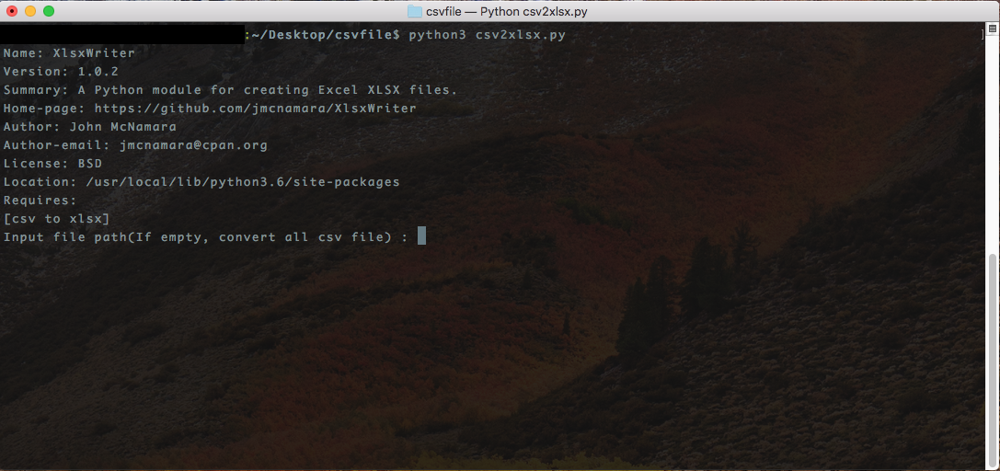
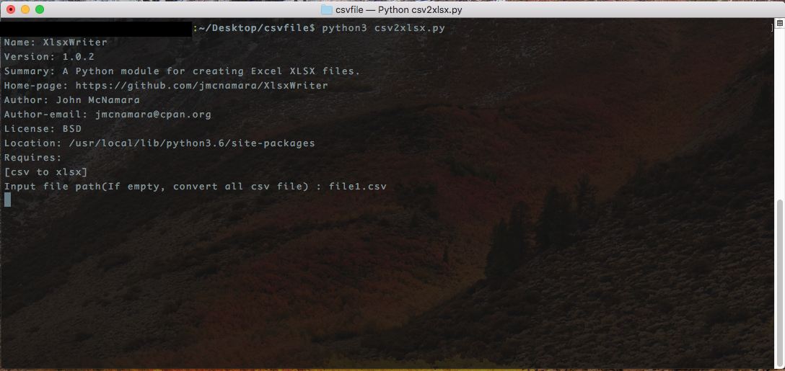
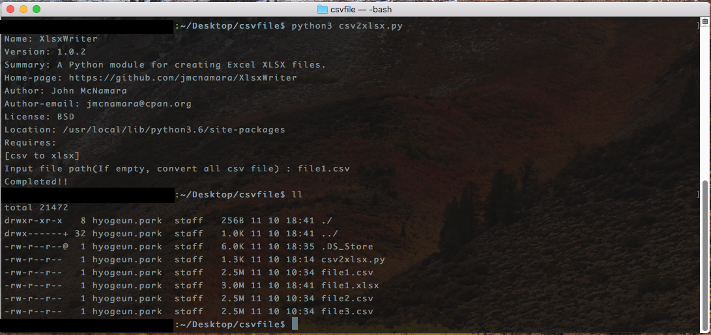
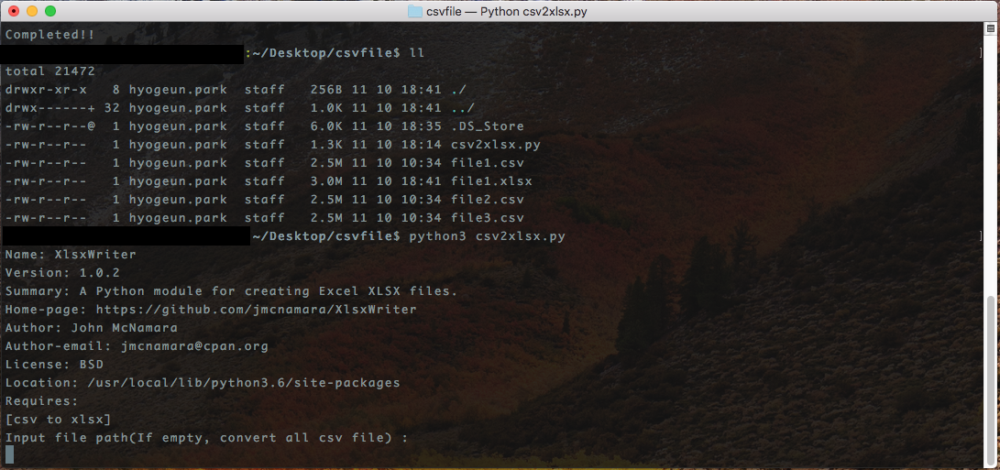
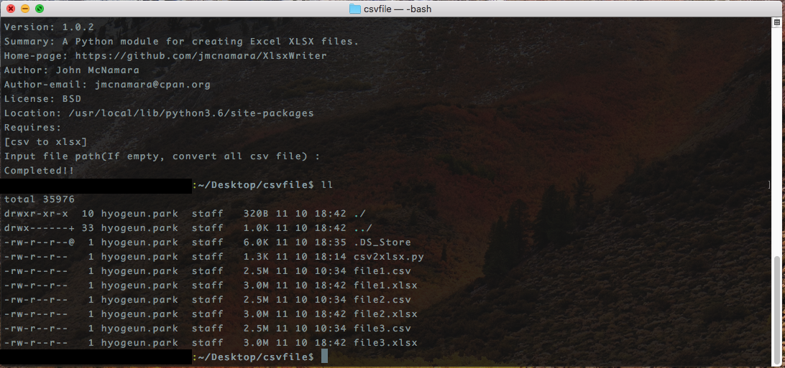

# csv2xlsx

#### Convert csv file to xlsx file using python

<br />

## How to Run(Require: python3)
```shell
python3 csv2xlsx.py
```
(if pip install error, run below command)
```shell
sudo python3 csv2xlsx.py
```

<br />

## Result
#### • convert csv file
1. run csv2xlsx.py
  
  
2. input csv file name(don't forget adding .csv)
  
  
3. complete converting csv file(file1.csv -> file1.xlsx)
  

### • convert all csv files in current directory
1. run csv2xlsx.py
  
  
2. input empty string(press your enter button) and then complete converting all csv files(file2.csv, file3.csv -> file2.xlsx, file3.xlsx)
  


## License
```
MIT License

Copyright (c) 2017 hyogeun.park

Permission is hereby granted, free of charge, to any person obtaining a copy
of this software and associated documentation files (the "Software"), to deal
in the Software without restriction, including without limitation the rights
to use, copy, modify, merge, publish, distribute, sublicense, and/or sell
copies of the Software, and to permit persons to whom the Software is
furnished to do so, subject to the following conditions:

The above copyright notice and this permission notice shall be included in all
copies or substantial portions of the Software.

THE SOFTWARE IS PROVIDED "AS IS", WITHOUT WARRANTY OF ANY KIND, EXPRESS OR
IMPLIED, INCLUDING BUT NOT LIMITED TO THE WARRANTIES OF MERCHANTABILITY,
FITNESS FOR A PARTICULAR PURPOSE AND NONINFRINGEMENT. IN NO EVENT SHALL THE
AUTHORS OR COPYRIGHT HOLDERS BE LIABLE FOR ANY CLAIM, DAMAGES OR OTHER
LIABILITY, WHETHER IN AN ACTION OF CONTRACT, TORT OR OTHERWISE, ARISING FROM,
OUT OF OR IN CONNECTION WITH THE SOFTWARE OR THE USE OR OTHER DEALINGS IN THE
SOFTWARE.
```
